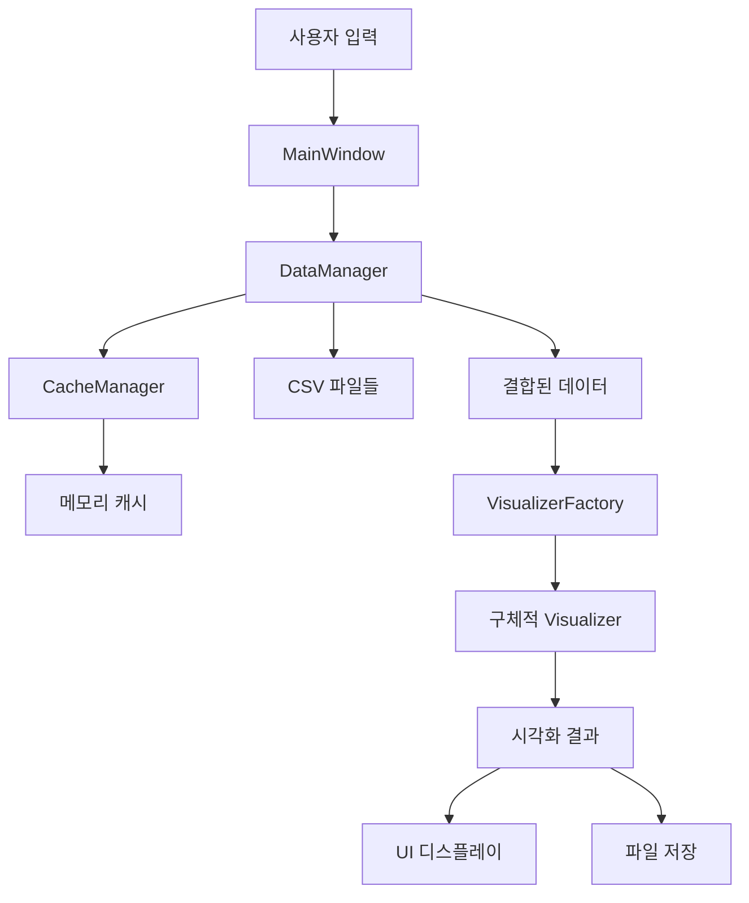

# dflux_InteractiveAnalyzer - 아키텍처 문서

## 📁 프로젝트 구조

```
touch_analyzer/
├── main.py                          # 메인 진입점
├── setup.py                         # 패키지 설치 스크립트
├── requirements.txt                 # 의존성 목록
├── README.md                        # 프로젝트 개요
├── .gitignore                       # Git 무시 파일
│
├── src/                             # 소스 코드
│   └── touch_analyzer/             # 메인 패키지
│       ├── __init__.py
│       ├── core/                   # 핵심 기능
│       │   ├── __init__.py
│       │   ├── data_manager.py     # 데이터 관리
│       │   ├── cache_manager.py    # 캐시 관리
│       │   └── config.py           # 설정 관리
│       ├── ui/                     # 사용자 인터페이스
│       │   ├── __init__.py
│       │   ├── main_window.py      # 메인 윈도우
│       │   ├── components.py       # UI 컴포넌트
│       │   └── styles.py           # 스타일 관리
│       ├── visualization/          # 시각화 모듈
│       │   ├── __init__.py
│       │   ├── heatmap.py          # 히트맵
│       │   ├── flow.py             # 플로우
│       │   ├── statistics.py       # 통계
│       │   ├── layer_analysis.py   # 레이어 분석
│       │   └── visualizer_factory.py # 팩토리 패턴
│       └── utils/                  # 유틸리티
│           ├── __init__.py
│           ├── file_utils.py       # 파일 유틸리티
│           ├── memory_utils.py     # 메모리 관리
│           └── logging_utils.py    # 로깅 유틸리티
│
├── config/                         # 설정 파일
│   └── settings.py                 # 애플리케이션 설정
│
├── tests/                          # 테스트 코드
│   ├── __init__.py
│   ├── test_core/
│   ├── test_ui/
│   ├── test_visualization/
│   └── test_utils/
│
├── docs/                           # 문서
│   ├── ARCHITECTURE.md             # 아키텍처 문서 (이 파일)
│   ├── API.md                      # API 문서
│   └── DEVELOPMENT.md              # 개발 가이드
│
├── scripts/                        # 유틸리티 스크립트
│   └── dev.py                      # 개발 도구
│
├── data_log/                     # 로그 데이터 (기존: data_touch)
├── data_bg/                        # 배경 이미지 (기존: background_images)
├── data_results/                   # 결과 출력 (기존: output_results)
├── backup/                         # 백업 파일 (기존)
└── touch_analyzer_env/             # 가상환경 (기존)
```

## 🏗️ 아키텍처 설계 원칙

### 1. 관심사의 분리 (Separation of Concerns)
- **Core**: 비즈니스 로직과 데이터 처리
- **UI**: 사용자 인터페이스 및 상호작용
- **Visualization**: 시각화 기능
- **Utils**: 공통 유틸리티 기능

### 2. 의존성 역전 (Dependency Inversion)
- 상위 모듈이 하위 모듈에 의존하지 않음
- 추상화를 통한 느슨한 결합

### 3. 단일 책임 원칙 (Single Responsibility Principle)
- 각 클래스와 모듈은 하나의 책임만 가짐
- 변경의 이유가 하나여야 함

### 4. 개방-폐쇄 원칙 (Open-Closed Principle)
- 확장에는 열려있고 수정에는 닫혀있음
- 새로운 시각화 추가 시 기존 코드 수정 최소화

## 📦 주요 컴포넌트

### Core 모듈

#### DataManager
```python
class DataManager:
    """데이터 로딩, 검증, 변환을 담당"""
    - get_user_list() -> List[str]
    - load_file(file_path) -> Optional[pd.DataFrame]
    - load_and_combine_data(file_paths) -> Optional[pd.DataFrame]
```

#### CacheManager
```python
class CacheManager:
    """LRU 캐시 관리"""
    - get(key) -> Optional[Any]
    - put(key, value) -> None
    - clear() -> None
```

#### Config
```python
class Config:
    """애플리케이션 설정 관리"""
    - 모든 하드코딩된 값들을 중앙 집중 관리
    - 환경별 설정 지원
```

### UI 모듈

#### MainWindow
```python
class MainWindow:
    """메인 GUI 윈도우"""
    - 전체 UI 레이아웃 관리
    - 탭 및 컴포넌트 조정
```

#### Components
- **RangeSlider**: 시간 범위 선택
- **TabManager**: 탭 관리
- **FileSelector**: 파일 선택

### Visualization 모듈

#### VisualizerFactory
```python
class VisualizerFactory:
    """시각화 객체 생성 팩토리"""
    - create_heatmap_visualizer()
    - create_flow_visualizer()
    - create_statistics_visualizer()
```

#### 개별 Visualizer들
- **HeatmapVisualizer**: 히트맵 생성
- **FlowVisualizer**: 플로우 다이어그램
- **StatisticsVisualizer**: 통계 차트
- **LayerAnalysisVisualizer**: 레이어 분석

### Utils 모듈

#### FileUtils
- 파일 경로 관리
- 리소스 접근
- 디렉토리 생성

#### MemoryUtils
- 메모리 모니터링
- 리소스 정리
- 성능 추적

#### LoggingUtils
- 로그 설정
- 컨텍스트 로깅
- 데코레이터 제공

## 🔄 데이터 흐름



## 🔌 확장 포인트

### 새로운 시각화 추가
1. `src/touch_analyzer/visualization/` 에 새 파일 생성
2. `BaseVisualizer` 상속하여 구현
3. `VisualizerFactory`에 생성 메서드 추가
4. UI에 새 탭 추가

### 새로운 데이터 소스 추가
1. `DataManager`에 새 로더 메서드 추가
2. 필요시 새 `DataLoader` 클래스 생성
3. 설정에 새 데이터 형식 정보 추가

### 새로운 UI 컴포넌트 추가
1. `src/touch_analyzer/ui/components.py`에 구현
2. `MainWindow`에서 사용
3. 스타일링은 `styles.py`에 추가

## 🧪 테스트 전략

### 단위 테스트
- 각 모듈별 독립적 테스트
- Mock 객체를 활용한 의존성 격리

### 통합 테스트
- 모듈 간 상호작용 테스트
- 실제 데이터를 활용한 End-to-End 테스트

### 성능 테스트
- 대용량 데이터 처리 성능
- 메모리 사용량 모니터링

## 📈 성능 고려사항

### 메모리 최적화
- LRU 캐시로 자주 사용하는 데이터 보관
- pandas 데이터타입 최적화
- 사용 완료된 객체 명시적 해제

### 처리 속도 최적화
- 적응적 시각화 해상도
- 백그라운드 데이터 로딩
- UI 응답성 유지

### 확장성
- 모듈화된 구조로 기능 추가 용이
- 설정 기반 동작으로 유연성 확보
- 플러그인 아키텍처 고려

## 🔒 보안 고려사항

### 데이터 보안
- 로컬 파일 시스템만 접근
- 사용자 데이터 외부 전송 없음

### 코드 보안
- 입력 검증 및 예외 처리
- 메모리 안전성 확보

## 🚀 배포 전략

### 개발 환경
```bash
pip install -e .[dev,monitoring]
python scripts/dev.py all
```

### 프로덕션 환경
```bash
pip install .
python main.py
```

### 패키징
```bash
python setup.py sdist bdist_wheel
pyinstaller main.py --onefile
```

이 아키텍처는 유지보수성, 확장성, 성능을 모두 고려하여 설계되었으며, 향후 요구사항 변경에도 유연하게 대응할 수 있습니다.
